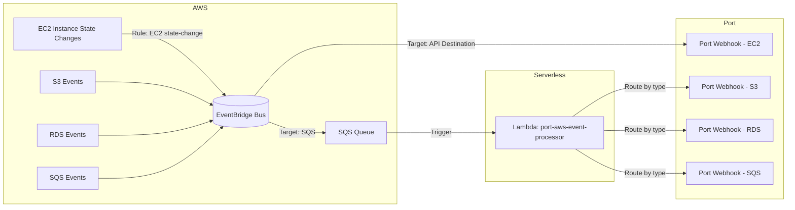

# AWS-Serverless
AWS integration to port.io that is event driven and serverless

## These terraform scripts will:

### Within Port:
1. Create a webhook for each AWS type supported
1. Set up blueprints and mappings for each supported AWS type

### Within AWS:
1. Create/validate an SQS queue
1. Create an EventBridge rule in the AWS account.
    1. Filter on the supported AWS types
    1. For all events, put the event into SQS
1. Create a lambda that reads SQS and put the events into the correct webhook
    1. Uses env variables for:
         1. webhook secret
         1. SQS queue name
         1. webhook name for each supported service
1. Create a rule to run the lambda when the SQS queue > 0

## Supported AWS types:
* EC2 instances
* Current running state of EC2 instances
* S3 buckets
* RDS instances
* SQS queues

## Shortfalls compared to current Ocean integration:
* K8s inspection
* Multi-account support

## Improvements/TODO/Open Questions
* Should it use one webhook vs one per type?
* Should it use webhooks vs API?
* What additional AWS types should we support out of the box?

---

## Quickstart with Makefile

Prereqs:
- Terraform >= 1.0.0 on PATH
- zip on PATH
- AWS credentials configured (e.g., via AWS CLI/profile or env vars)
- Port.io Client ID/Secret

Setup:
1) Copy and edit variables
```
cp terraform/terraform.tfvars.example terraform/terraform.tfvars
# Edit terraform/terraform.tfvars with your real values
```

2) Build Lambda package (stub created if you don’t have one yet)
```
make package
```
This generates `lambda/aws_port_handler.zip` which Terraform expects at `../lambda/aws_port_handler.zip` relative to the `terraform` folder.

3) Initialize and deploy
```
make init
make plan
make apply
```

Other targets:
- `make check`   – validates required tools and tfvars presence
- `make destroy` – tears down the stack
- `make clean`   – removes the built lambda zip

Notes:
- The Lambda handler is configured as `driver.lambda_handler`. If you provide your own code, include `driver.py` and ensure the function name matches.
- To override webhook URLs (if you already created them), populate the `webhook_urls` map in `terraform/terraform.tfvars`.

---

## Data flow


